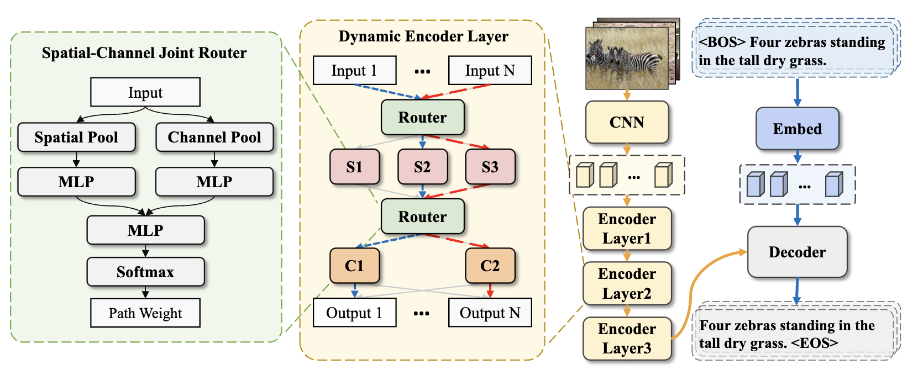
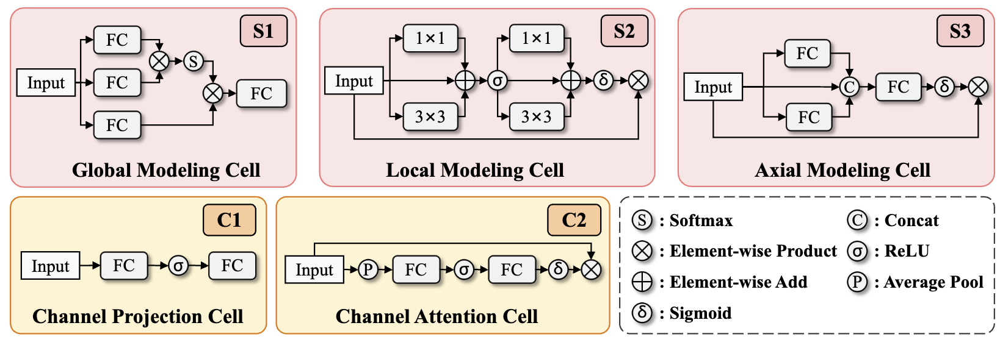
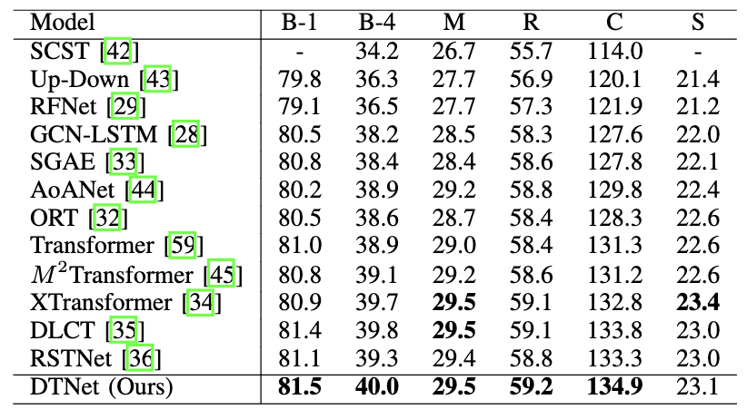
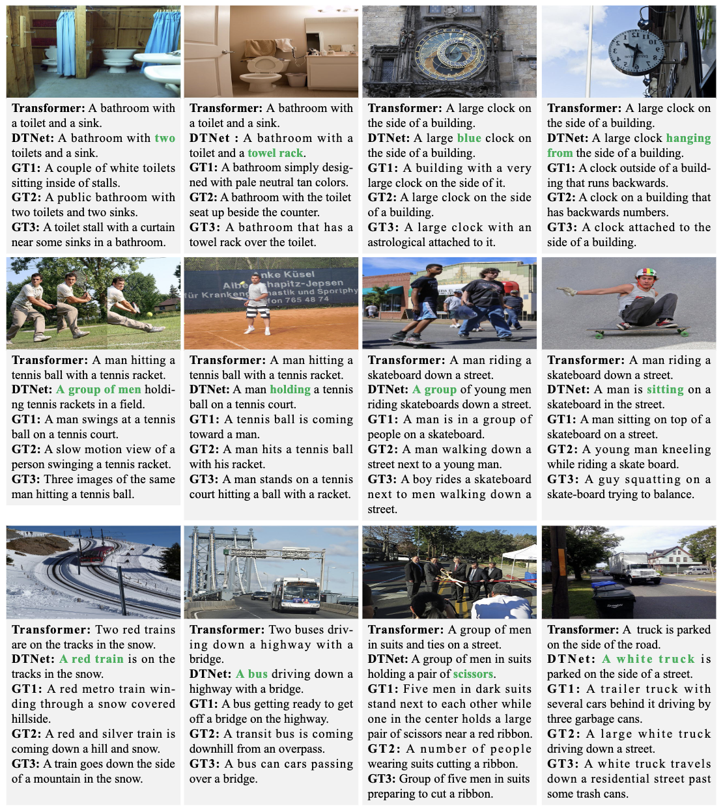
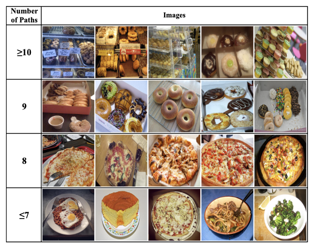
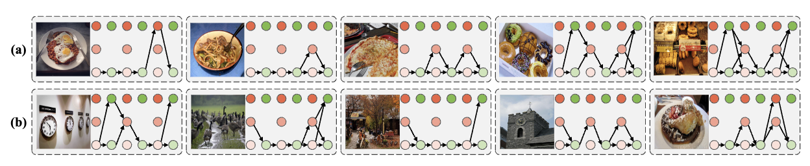

# Image Captioning via Dynamic Path Customization


## Introduction
The official repository for “Image Captioning via Dynamic Path Customization”.

Dynamic Transformer Network (DTNet) is a model to genrate discriminative yet accurate captions, which dynamically assigns customized paths to different samples.

<p align="center">
     <br>
    The framework of the proposed Dynamic Transformer Network (DTNet) 
</p>


<p align="center">
     <br>
    The detailed architectures of different cells in the spatial and channel routing space.
</p>

## News

- 2023.09.29: Released code


## Environment setup

Please refer to [meshed-memory-transformer](https://github.com/aimagelab/meshed-memory-transformer)

## Data preparation

* **Annotation**. Download the annotation file [annotation.zip](https://drive.google.com/file/d/1i8mqKFKhqvBr8kEp3DbIh9-9UNAfKGmE/view?usp=sharing). Extarct and put it in the project root directory.
* **Feature**. You can download our ResNeXt-101 feature (hdf5 file) [here](https://pan.baidu.com/s/1xVZO7t8k4H_l3aEyuA-KXQ). Acess code: jcj6.
* **evaluation**. Download the evaluation tools [here](https://pan.baidu.com/s/1xVZO7t8k4H_l3aEyuA-KXQ). Acess code: jcj6. Extarct and put it in the project root directory.

## Training
```python
python train.py --exp_name DTNet --batch_size 50 --rl_batch_size 100 --workers 4 --head 8 --warmup 10000 --features_path /home/data/coco_grid_feats2.hdf5 --annotation /home/data/m2_annotations --logs_folder tensorboard_logs
```
## Evaluation
```python
python eval.py --batch_size 50 --exp_name DTNet --features_path /home/data/coco_grid_feats2.hdf5 --annotation /home/data/m2_annotations --ckpt_path your_model_path
```

## Performance

<p align="center">
     <br>
    Comparisons with SOTAs on the Karpathy test split.
</p>


## Qualitative Results

<p align="center">
     <br>
    Examples of captions generated by Transformer and DTNet.
</p>


<p align="center">
     <br>
    Images and the corresponding number of passed cells.
</p>

<p align="center">
     <br>
    Path Visualization.
</p>

## Acknowledgements
- Thanks the [meshed-memory-transformer](https://github.com/aimagelab/meshed-memory-transformer).
- Thanks the amazing work of [grid-feats-vqa](https://github.com/facebookresearch/grid-feats-vqa). 